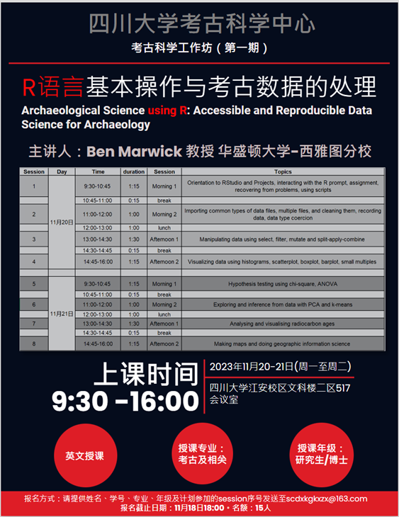

# Sichuan University Workshop: Archaeological Science using R: Accessible and Reproducible Data Science for Archaeology 

| Day | Time         | Duration | Session     | Topics                                                                                                                  |
|-----|--------------|----------|-------------|-------------------------------------------------------------------------------------------------------------------------|
| 1   | 9:30-10:45   | 1:15     | Morning 1   | Orientation to RStudio and Projects, interacting with the R prompt, assignment, recovering from problems, using scripts |
| 1   | 10:45-11:00  | 0:15     | break       |                                                                                                                         |
| 1   | 11:00-12:00  | 1:00     | Morning 2   | [Importing common types of data files, multiple files, and cleaning them, recording data, data type coercion](https://github.com/benmarwick/2018-04-13-saa/blob/9dedde861623dabe762e0ffd2b0c1598d0f2da57/workshop/SAA2018-Archaeological-Data-Science-Using-R-A-Short-Workshop.R#L69)             |
| 1   | 12:00-13:00  | 1:00     | lunch       |                                                                                                                         |
| 1   | 13:00-14:30  | 1:30     | Afternoon 1 | [Manipulating data using select, filter, mutate and split-apply-combine](https://docs.google.com/presentation/d/12V0PEoJGFzKQQPljIL5Q2ASjAIYlSeV4/edit#slide=id.p1)                                                  |
| 1   | 14:30-14:45  | 0:15     | break       |                                                                                                                         |
| 1   | 14:45-16:00  |  1:15    | Afternoon 2 | [Visualizing data using histograms, scatterplot, boxplot, barplot, small multiples](https://benmarwick.github.io/tidyverse-for-archaeology/tidyverse-for-archaeology.html#159)                                       |
|     |              |          |             |                                                                                                                         |
| 2   | 9:30-10:45   | 1:15     | Morning 1   | [Hypothesis testing using chi-square, ANOVA](https://benmarwick.github.io/stat-inference-and-exploration-for-archaeologists/stat-inference-and-exploration-for-archaeologists.html#1)                                                                              |
| 2   | 10:45-11:00  | 0:15     | break       |                                                                                                                         |
| 2   | 11:00-12:00  | 1:00     | Morning 2   | [Exploring and inference from data with PCA and k-means](https://benmarwick.github.io/stat-inference-and-exploration-for-archaeologists/stat-inference-and-exploration-for-archaeologists.html#137)                                                                  |
| 2   | 12:00-13:00  | 1:00     | lunch       |                                                                                                                         |
| 2   | 13:00-14:30  | 1:30     | Afternoon 1 | [Analysing and visualising radiocarbon ages](https://github.com/benmarwick/Analysing-Archaeological-Radiocabon-Ages-Using-R)                                                                              |
| 2   | 14:30-14:45  | 0:15     | break       |                                                                                                                         |
| 2   | 14:45-16:00  | 1:15     | Afternoon 2 | [Making maps and doing geographic information science](https://github.com/benmarwick/2018-04-13-saa/blob/9dedde861623dabe762e0ffd2b0c1598d0f2da57/workshop/SAA2018-Archaeological-Data-Science-Using-R-A-Short-Workshop.R#L996)  

Click on this button to write code in your web browser (no log in required, file changes do not persist beyond the current session): 

One of the workshop participants, Marvin Wu, has shared his notes and code from the workshop here: https://github.com/marvinwu-legmed/R_Archeo

Here is the poster that was prepared for the workshop:

